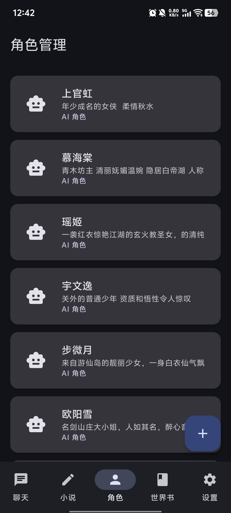
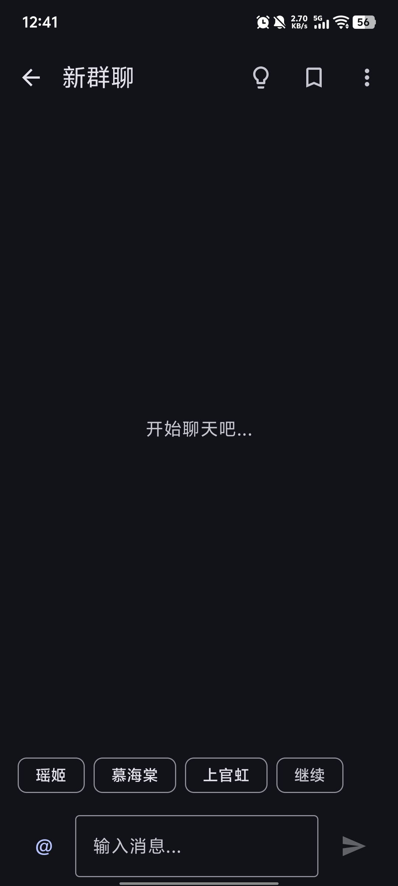
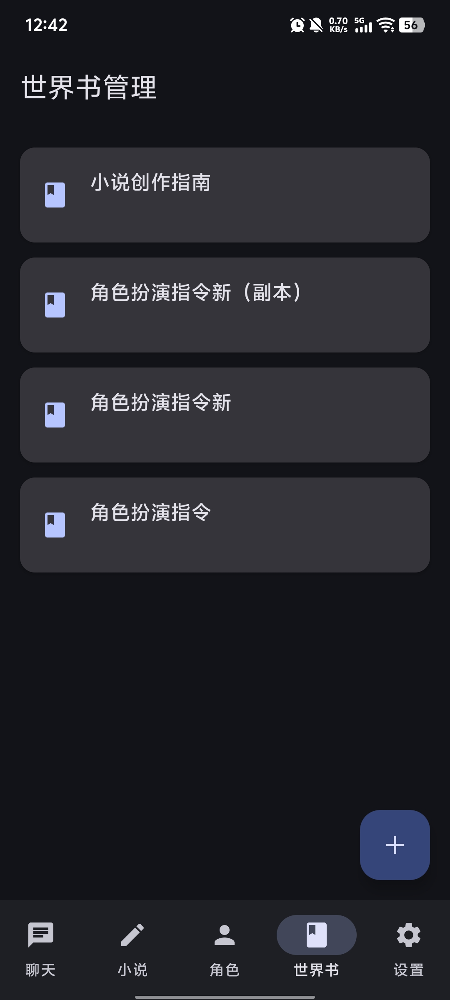
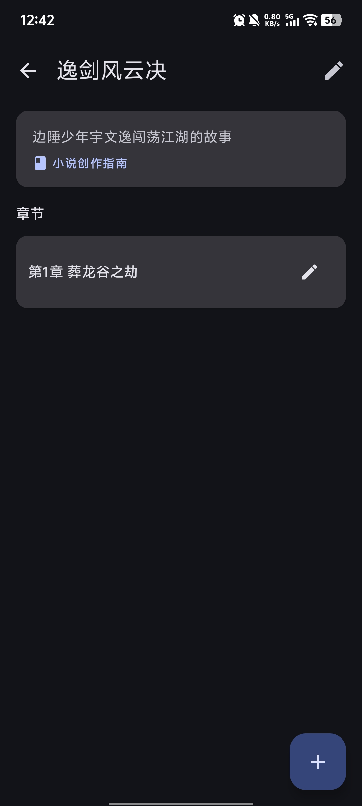
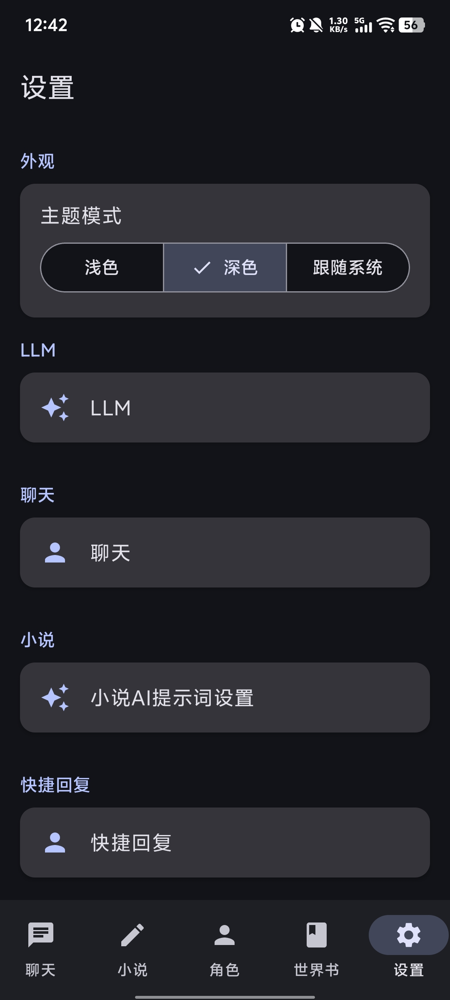
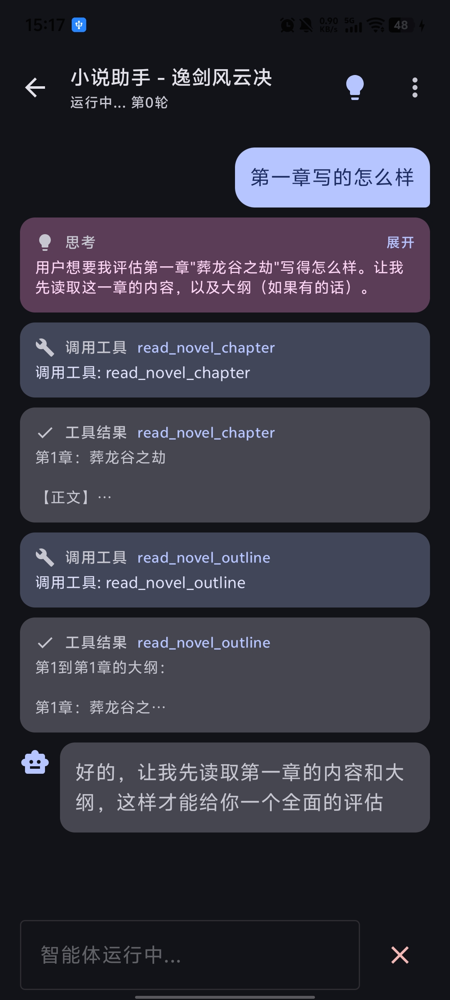
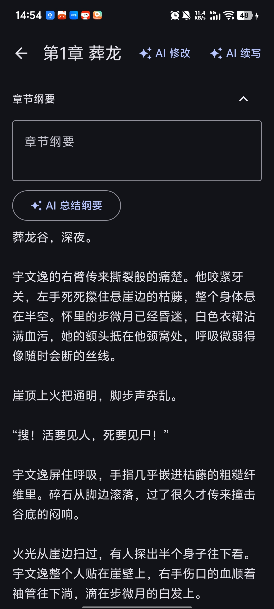

# 我的酒馆 · My Tavern

<p align="center">
  <b>一个可以使用 AI 创作小说、和小说人物聊天的 Android App</b><br>
  <b>没有复杂的设置，我称之为“我的酒馆”</b>
</p>

---

## 🌟 功能特性

> **标签**：纯文本 · LLM RPG · 小说创作 · Android

- **🤖 多模型兼容**
  - 支持 OpenAI 格式兼容的 LLM API
  - 可自定义 Base URL、API Key、模型名称与参数

- **👤 角色管理**
  - 创建、编辑、删除角色卡
  - 支持 AI 辅助生成角色设定
  - 角色头像、性格描述、背景故事一目了然

- **📖 世界书**
  - 简单的世界书系统（本质是系统提示词管理）
  - 为你的故事和聊天构建统一的世界观

- **💬 单聊 / 群聊**
  - 与单个角色进行沉浸式对话
  - 群聊支持多角色同时在线
  - `@角色名` 指定回复对象
  - 接话模式让对话更自然流畅
  - 双击角色名可触发该角色继续发言

- **✍️ 小说创作**
  - AI 辅助续写与改写
  - 智能体点评和创作辅助
  - 章节管理与大纲折叠编辑
  - 提示词管理与快速复用

- **🌙 其他特性**
  - 黑夜主题支持
  - 用量统计（Token 消耗）
  - 请求日志记录与查看
  - 数据导出 / 导入（`.db` 数据库备份）
  - 本地离线数据存储，隐私优先

---

## 📸 截图展示
| 角色管理 | 群聊对话 | 世界书 |
|:---:|:---:|:---:|
|  |  |  |
| 小说创作 | 设置页面 | 智能体 |
|:---:|:---:|:---:|
|  |  |  |
| AI 辅助 |
|:---:|
|  |
---

## 🛠 技术栈

| 层级 | 技术 |
|---|---|
| **UI** | Jetpack Compose + Material 3（纯 Compose，无 XML Layout） |
| **架构** | MVVM + Repository 模式 |
| **依赖注入** | 手动 DI（`AppContainer.kt`） |
| **导航** | Compose Navigation |
| **数据持久化** | Room + SQLite（Schema 导出至 `app/schemas`） |
| **网络请求** | Retrofit + OkHttp + kotlinx.serialization |
| **图片加载** | Coil |
| **异步** | Kotlin Coroutines + Flow |
| **本地配置** | DataStore Preferences |

---

## 🏗 项目结构

```
org.jiangstack.mytavern
├── data/
│   ├── local/          # Room 数据库、Entity、Dao、迁移脚本
│   ├── remote/         # LLM API 接口（OpenAI / OpenResponses / Anthropic）
│   └── repository/     # Repository 实现
├── domain/
│   ├── model/          # 业务实体（角色、世界书、对话、小说等）
│   ├── repository/     # Repository 接口
│   └── service/        # LlmService（流式/非流式请求、多 API 适配）
├── ui/
│   ├── theme/          # 主题、颜色、字体
│   ├── navigation/     # Compose Navigation 路由
│   ├── character/      # 角色管理界面
│   ├── worldbook/      # 世界书管理界面
│   ├── chat/           # 聊天界面
│   ├── novel/          # 小说创作界面
│   └── settings/       # 设置界面
├── AppContainer.kt     # 手动 DI 容器
├── MyTavernApplication.kt
└── MainActivity.kt
```

---

## 🚀 快速开始

暂无

## 📖 使用指南

### 1. 配置 LLM API

首次使用请进入「设置 → LLM 配置」，填入：

- **Base URL**：例如 `https://api.openai.com/v1/`
- **API Key**：你的 API 密钥
- **模型名称**：例如 `gpt-4o-mini`、`claude-3-5-sonnet-20241022`

### 2. 创建角色

进入「角色」页面，点击右下角按钮创建角色。你可以：

- 手动填写角色设定
- 使用 AI 辅助生成角色背景、性格、开场白

### 3. 开始聊天

进入「聊天」页面创建会话，选择单个或多个角色即可开始对话。群聊中：

- 输入 `@角色名` 让指定角色回复
- 不 @ 任何人时，App 会自动选择“接话”角色
- 双击 AI 消息中的角色名可再次触发该角色发言

### 4. 创作小说

进入「小说」页面创建小说：

- 关联世界书和角色
- 添加章节和大纲
- 在章节编辑器中使用 AI 续写正文
- 流式生成的内容可「采纳」或「丢弃」

### 5. 数据备份

通过「设置 → 数据管理」可以导出或导入 `.db` 数据库文件，方便备份与迁移。


---

本项目采用 [MIT License](./LICENSE) 开源。

---

<p align="center">
  如果这个项目对你有帮助，欢迎 ⭐ Star 支持！
</p>
